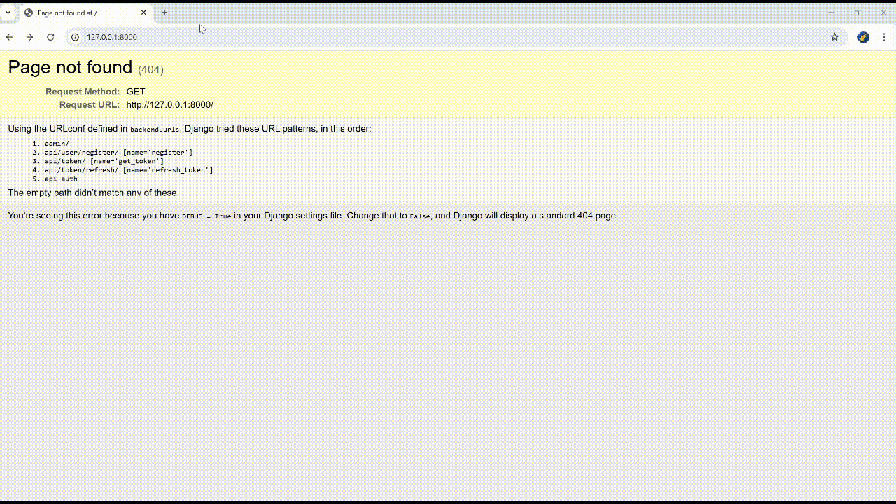
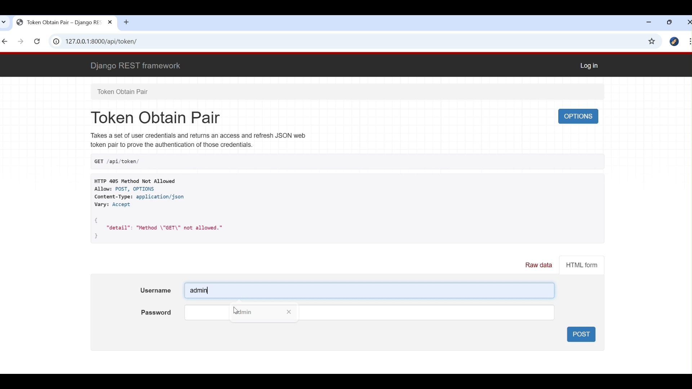

backend directory
    - api: for applications, e.g. authentication
    - backend: some files related to setting

JWT (Json Web Token)
pass some crendentials to frontend
frontend will sent the token to backend

access token: request
refresh token: to refresh the access token

1. after set Django properly (settings.py)
2. make the registration view
    1. serializers.py 
    2. view.py to add views
    3. urls.py: configure all different urls
    4. make migration on database
    `python manage.py makemigrations`
    5. apply the migrations
    `python manage.py migrate`
    6. run the application (stop the server Ctrl+C)
    `python manage.py runserver`
    7. open the url and check the function http://127.0.0.1:8000/
        go to different routes by changing the url, e.g. http://127.0.0.1:8000/api/user.register
        

8. create custome models: models.py 
    - make a serilizer for this model: serializers.py
    - make views for creating, reading and deleting notes
    - create urls for views: api/urls.py
    - link urls from main urls.py into api/urls.py: url.py
    - make a migration to database and migrate
    - run the application and test it
    