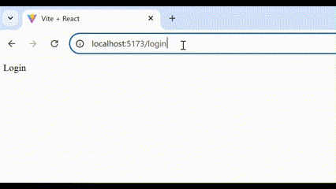

# React + Vite

This template provides a minimal setup to get React working in Vite with HMR and some ESLint rules.

Currently, two official plugins are available:

- [@vitejs/plugin-react](https://github.com/vitejs/vite-plugin-react/blob/main/packages/plugin-react/README.md) uses [Babel](https://babeljs.io/) for Fast Refresh
- [@vitejs/plugin-react-swc](https://github.com/vitejs/vite-plugin-react-swc) uses [SWC](https://swc.rs/) for Fast Refresh

1. use vite to install a react template
`npm create vite@latest frontend -- --template react`
2. install necessary packages
```bash
cd frontend
npm install axios react-router-dom jwt-decode 
```
3. delete css files: src/App.css, index.css
4. organize frontend: App.jsx, main.jsx
    - create directories in src: pages, styles, components
    - add files in src: constants.js, api.js
    - add environment variable file in frontend: .env
6. constants.js, api.js. .env
7. write protected routes: components/ProtectedRoute.jsx
8. create pages: Home.jsx, Login, NotFound, Register
9. write navigation in App.jsx
10. run this project
```bash
  npm install
  npm run dev
```

